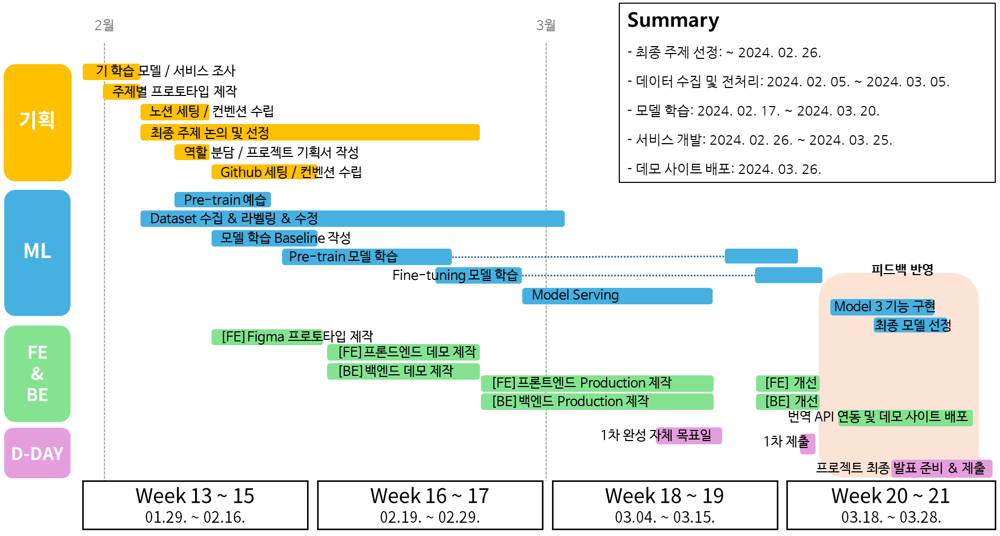
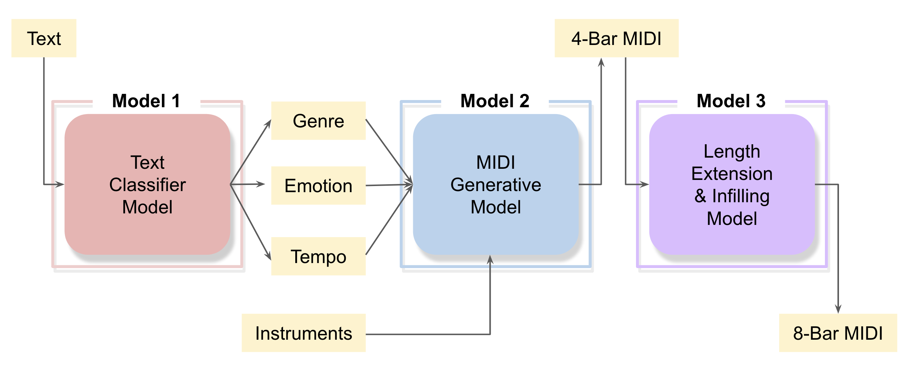
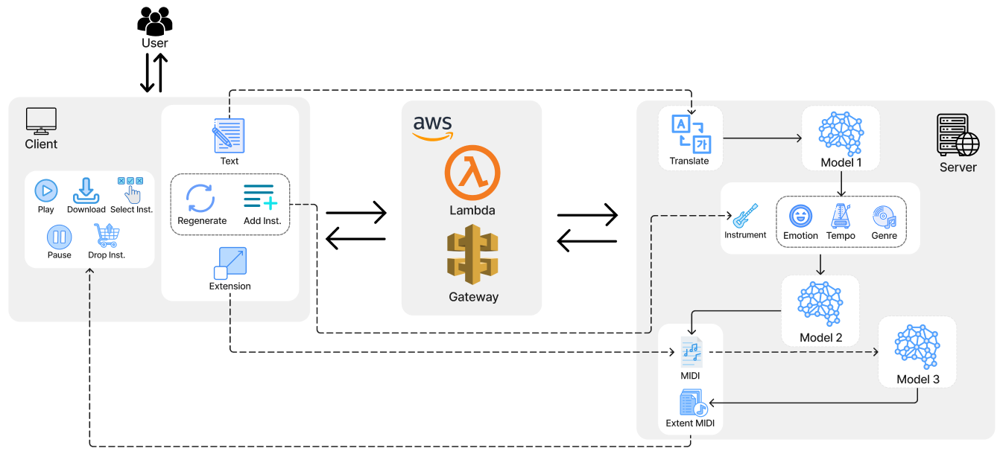

## 디지털 악보와 언어 모델을 이용한 음악 생성 프로젝트

<table>
  <tr>
    <td style="text-align:left;" width=420>
       

          <b>데모 앱 링크 - </b>https://codeplay-ai.netlify.app
       

    </td>
    <td style="text-align:center; border-color:white" rowspan="3" width=660>
      

        
      

    </td>  
  </tr>
  <tr>
  </tr>
  <tr>
      <td style="text-align:left;">
        

          <b>시연 영상 링크 - </b>https://youtu.be/PThn811Lli8
        

      </td>
  </tr>
</table>

## 팀원 소개

---

<table>
  <tr></tr>
  <tr>
    <td width=180>
       

         <a href="https://github.com/patcasso"><b>정지영</b></a>
       

    </td>
    <td width=210>
      

        <a href="https://github.com/seohyunee22"><b>양서현</b></a>
      

    </td>
    <td width=170>
      

        <a href="https://github.com/sanggank"><b>이상경</b></a>
      

    </td>
    <td width=170>
      

        <a href="https://github.com/devBuzz142"><b>정종관</b></a>
      

    </td>
    <td width=160>
      

        <a href="https://github.com/tmdqor"><b>이승백</b></a>
      

    </td>
    <td width=190>
      

        <a href="https://github.com/nachalsa"><b>이주용</b></a>
      

    </td>
  </tr>
  <tr>
    <td>
       - 팀장   - 프로젝트 기획   - 모델 조사 및 학습    베이스라인 코드   - 웹 프론트엔드
    </td>
    <td>
      - 데이터셋 조사 및 수집   - 토크나이징 방식 비교 및 실험   - 길이 연장 모델 (Model3) 구현
    </td>
    <td>
      - 데이터 생성 및 수집   - 텍스트 분류 모델 (Model1) 제작
    </td>
    <td>
      - 데이터 전처리   - 음악 생성 모델(Model2) 학습
    </td>
    <td>
      - 데이터 가공   - 백엔드 제작
    </td>
    <td>
      - 토큰나이징 방식 개선   - 생성방식 다각화 구상 및 실험
    </td>
  </tr>
</table>

## 개요

### 문제 정의

- 기존 음악 생성 서비스는 WAV 형식으로 생성됨.
- 생성된 음악을 특정 구간이나 악기를 변경하는 것과 같은 세부적인 편집이 어렵거나 불가능함.
- 결과적으로, 실제 음악 업계 종사자나 아마추어 작곡가들이 이러한 서비스를 이용하기 어려워함.

### 목표 및 기대 효과

- 목표 ⇒ 사용자가 자신의 감정이나 생각을 텍스트로 표현하면 이를 기반으로 편집 가능한 디지털 악보 형태의 데이터인 MIDI 파일이 생성하는 것
- 기대효과
  - 누구나 보다 쉽게 작곡을 할 수 있어 창작에 대한 진입장벽을 낮춤.
  - 기존 창작자에게 새로운 시각과 접근 방식을 제공하여 창의적 활동을 보조함.
    

## 모델링

### Model 1 : Text Classifier Model

- 입력 받은 text를 { `Genre`, `Emotion`, `Tempo` }로 분류
- Dataset (26k)
  - Input text : Llama2로 생성, Youtube comments crawling
  - Emotion : Llama2로 생성
  - Tempo : MIDI 파일 내에 존재하는 데이터
  - Genre : MIDI 메타데이터 정보
- 사용한 모델 : SamLowe/roberta-base-go_emotions
  - Reddit의 58,000개의 댓글을 28가지 감정으로 분류하도록 Fine-tuning 한 모델
- 기존 모델에 Layer 한 층을 병렬로 3개 연결하여 각각 { `Genre`, `Emotion`, `Tempo` } 분류

### Model 2 : MIDI Generative Model

- Model 1이 text prompt로부터 분류한 { `Genre`, `Emotion`, `Tempo`, `Instrument` } 정보를 바탕으로 MIDI 파일을 생성
- 기반 모델 : GPT-2
- Pre-training Dataset : [Lakh-MIDI-dataset](https://colinraffel.com/projects/lmd/) (17k)
  - Open-Source MIDI dataset
- Fine-tuning Dataset : Genre-Lakh(9k) + [Jazz](http://www.thejazzpage.de/index1.html) (0.2k) + [K-pop](https://www.aihub.or.kr/aihubdata/data/view.do?currMenu=115&topMenu=100&aihubDataSe=data&dataSetSn=71544) (13k) = 통합 데이터세트(22k)
  - 기존 Lakh 데이터는 Rock 장르에 편향되어 있으므로 장르 간 균형있게 샘플링한 데이터
  - 재즈, 케이팝(AI-Hub) 데이터
- NNN-tokenizer
  - `Note`(음정) + `Velocity`(강세) + `Duration`(지속시간) 를 바탕으로 MIDI파일을 토큰화
  - 기존 MIDI Tokenizer인 MMM Tokenizer 를 개량함

### Model 3 : Length Extension & Infilling Model

- 사용 모델 : Anticipatory Music Transformer (Lahk dataset, Trained to predict next event)
- 모델 채택 사유
  1. 짧은 시퀀스(4마디) output를 생성하는 Model 2의 한계 극복
  2. 잘 구현되어있는 기능을 변형하여 User들에게 다양한 선택지를 제공
  3. 같은 Symbolic Music Generative Model인 Model 2와의 기능적 호환
- 요약
  기능 1. Extending Music Length : 긴 시퀀스(길이)의 음악 생성
  - 기존: 주어진 미디파일의 길이를 초 단위로 연장(Extend)
  - 활용
    - 기존 기능 사용 시 BPM이 유실되는 문제가 발생
    - **연장 단위**를 기존 초 단위에서 **4마디 단위**로 변형
      기능 2. Infilling Desired Bar : 원하는 마디 재생성
  - 기존: 생성을 원하는 구간의 음악의 앞, 뒤(단위:초)의 정보가 주어지면, 중간 부분을 채워넣기(Infilling)
  - 활용: 재생성을 원하는 마디의 앞, 뒤(단위:마디)를 제공하여 재생성
    기능 3. Re-gen Instrument & Compatibility with Model 2 : 악기 재생성 및 Model 2와의 호환성

## Serving

- Frontend - React.js Website via Netlify
- Backend - FastAPI ML Server via NAVER Cloud Platform
- Proxy - AWS Lambda, AWS API Gateway

## 결과

### 결과 및 자체 평가 의견

- **성과**
  - 사용자가 입력한 프롬프트에서 3개의 토큰(`Emotion`, `Genre`, `Tempo`)를 성공적으로 추출해냄
  - 위 세 가지 토큰을 조건으로, 사용자가 원하는 분위기의 음악을 생성해냄
  - 특정 악기만 재생성 하더라도, 기존의 음악과 어울리는 트랙이 생성됨
  - 웹 프론트엔드 서비스가 기능에 맞게 잘 디자인되어 있음
  - 원하는 음악이 괜찮은 성능으로 잘 생성된 것을 알 수 있었음
- **한계점**
  - 데이터셋 장르 편향으로 Rock 장르가 가장 잘 생성되고, 다른 장르들의 퀄리티는 조금 아쉬운 면이 있음
  - 긴 길이의 음악 생성이 원활하지 않아서 아쉬움
  - 사용자가 상호작용을 할 수 있는 부분이 생각보다는 적게 구현되어 아쉬움
  - Scale-up을 위해 멀티 GPU 학습을 시도 했으나, Multi-Node Multi-GPU의 상황에서 오히려 모델의 성능이 저하됨

## 학습 및 생성 길이 연장

[사용자 피드백을 통한 강화학습](https://www.notion.so/77d570f7020d49acb1af290d575a07d9?pvs=21)

[텍스트를 인코딩 된 벡터로 변환 후 모델에 전달](https://www.notion.so/84c231c6c9654d55987b8cc88fb47adc?pvs=21)

[**입력 프롬프트 번역  API 추가**](https://www.notion.so/API-2c9c361a2ff843b5b6d5f7c8410bab57?pvs=21)

[**생성 길이 연장용 기학습 모델 추가**](https://www.notion.so/c42b5946d97d4b24a777cecb9600ba79?pvs=21)

## Appendix

## Reference

### ML

[1]  MMM : Exploring Conditional Multi-Track Music Generation with the Transformer. Jeff Ens, Philippe Pasquier(2020). _[arXiv preprint arXiv:2008.06048](https://arxiv.org/abs/2008.06048)_

[2]  YM2413-MDB: A MULTI-INSTRUMENTAL FM VIDEO GAME MUSIC DATASET WITH EMOTION

ANNOTATIONS. _[arXiv preprint arXiv:2211.07131](https://arxiv.org/abs/2211.07131)_

[3]  Anticipatory Music Transformer. _[arXiv preprint arXiv:2306.08620](https://arxiv.org/abs/2306.08620)_

[4]  Using 🤗 to Train a GPT-2 Model for Music Generation. Juan Carlos Piñeros(2023).

https://huggingface.co/blog/juancopi81/using-hugging-face-to-train-a-gpt-2-model-for-musi

[5]  SamLowe/roberta-base-go_emotions. https://huggingface.co/SamLowe/roberta-base-go_emotions

### Datasets

[6]  The Jazz Page. http://www.thejazzpage.de/

[7]  The Lakh MIDI Dataset v0.1. https://colinraffel.com/projects/lmd/

[8]  AI Hub 음악 유사성 판별 데이터. https://www.aihub.or.kr/aihubdata/data/view.do?currMenu=115&topMenu=100&aihubDataSe=data&dataSetSn=71544

  

  

